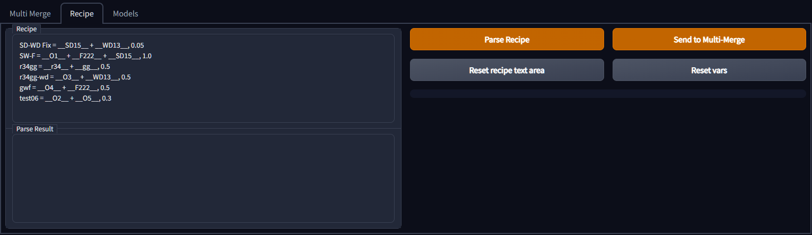
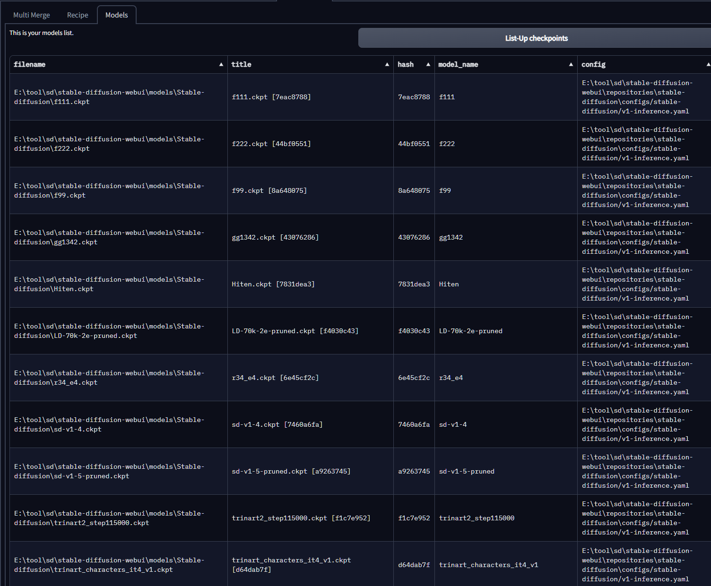
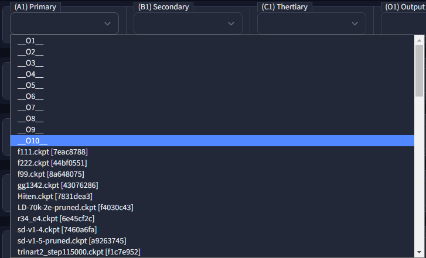
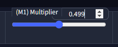
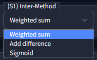
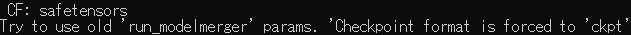
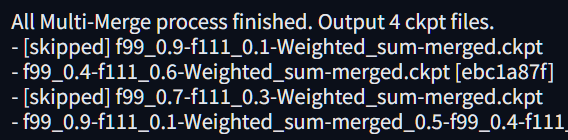
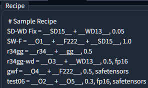
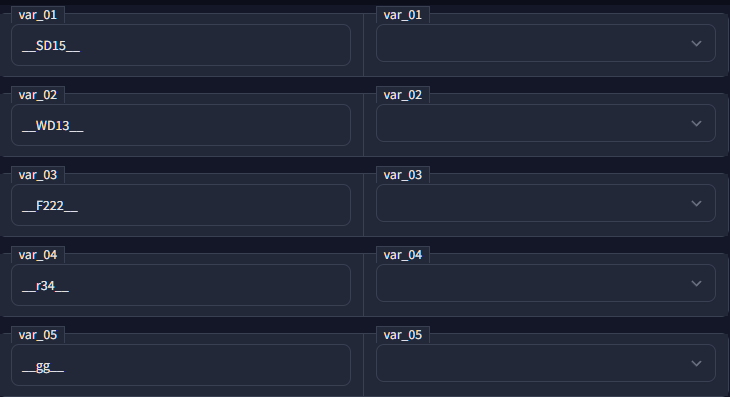

# Marge Board

| [Multi-Merge](## Multi-Marge) | [Merge Recipe](## Recipe) (Import/Export) | Checkpoint List    |
| ----------------------------- | ----------------------------------------- | ------------------ |
|             |                         |  |

- This is Extension for [AUTOMATIC1111's Stable Diffusion Web UI](https://github.com/AUTOMATIC1111/stable-diffusion-webui)

## Features

- **Multiple step marge** support ( up to 10 step)
- Save and Load your merging combination as `Recipe`, which is simple text.

## Recent Update

### 2023/09/03

- fix error with v1.6.0

  - these parames are set as default below:

```json
discard_weights = ""
bake_in_vae = "None"
add_merge_recipe = True
copy_metadata_fields = False
metadata_json = "{}"
```

### 2022/12/28

- Add support of **Log file** for keep record of your merges.

  - you can find your logfile on `(extension's dir)/csv/history.tsv`

## How to Install

- Go to `Extensions` tab on your web UI

- `Install from URL` with this repo URL

- Install

## Multi-Marge


- 10 lane of merge settings
  
   - merge start from lane 1 to 10
  
   - If A (model A) or B (model B) is blank, this lane will be ignored.
  
   - If C (model C) is blank and Method is "Add Diff", this lane is ignored

- with `Run Merge`, all merge is processed one by one.

- you can use variables for former lane's Output(O) to later lanes Input(A,B,C)
  
   - choose variable as ckpt in dropdown, `__O1__` form. (number correspond to lane)
     
      - i.e.) in second lane, you can specify model as `modelA(A2): __O1__`
  
   - can not use future(not yet generated) output as variable
     
      - bad example) in second lane, `modelA(A2): __O3__`
  
  |   | Select checkpoint by Dropdown. You can select Output checkpoint of each lane by variables like `__O1__`.                                                                                                |
  | ----------------------- | ------------------------------------------------------------------------------------------------------------------------------------------------------------------------------------------------------- |
  |     | Multiplier digit is extended to 0.001 step.                                                                                                                                                             |
  |    | Merging method. Weighted Sum, Add difference, Sigmoid. Implementation of "Sigmoid" is from old-days A1111 code, and this value is exchanged by inv-sigmoid in merging process and used as Weighted Sum. |
  |  | Add information of used models as metadata of 'safetensors'.                                                                                                                                            |

- "Checkpoint format"
  
   - For backward compatibility, if old "run_modelmerger" found, force "ckpt" as "(CF)Checkpoint format" setting
     
     

- "Skip Merge if same name checkpoint already exists"
  
  

- When checked, Merge-Board check "Output checkpoint name" at start of merging, and skip this lane if checkpoint already exists.
  

## Recipe


- Treat Your complicated model merging `Recipe` as 1 text

- with this UI, `Read`, `Load`, `Save`file in `Recipe` format.

### Recipe file Format



- this is sample Recipe

- each line represents one marge process.

- you can use variable for former line output,

- With recipe, you can share your Variables.

## Variables

- you can use other variables in Recipe

### System variables

| Variable | Note                       |
| -------- | -------------------------- |
| `__O1__` | Output ckpt-file of Lane.1 |
| `__Ox__` | Output ckpt-file of Lane.x |

### User variables

- You can use variables as form below.

- By variables, User can set own ckpt to variables.

| Sample               | Note                                                                                    |
| -------------------- | --------------------------------------------------------------------------------------- |
| `__SD15__`           | Use it as variable of Stable Diffusion v1.5.<br/>User can select ckpt file by Dropdown. |
|  |                                                                    |

## Comments and Note

- You can add comment/note by start line with `#` mark. This line will be ignored.

```
# These
# Lines
# is ignored
```

## Recipe sample

```
# Sample Recipe
a14 = __SD14__ + __F222__, 0.5
a15 = __SD15__ + __F222__, 0.5, fp16
mix14 = __O1__ + __WD13__ + __SD14__, 1.0, safetensors
mix15 = __O2__ + __WD13__ + __SD14__, 1.0, fp16, safetensors

# variables
__F222__ # You can use F111 instead.
__SD14__ # use stable diffusion v1.5, as you like.
```
